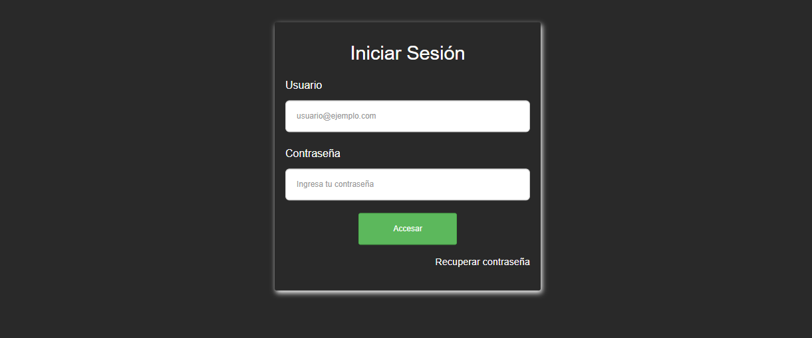
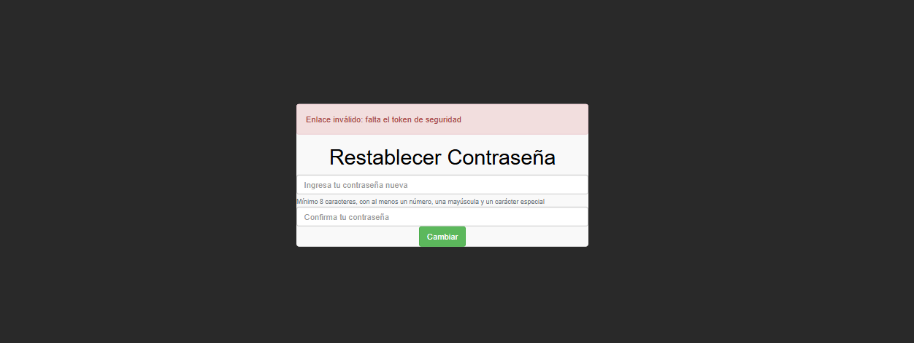
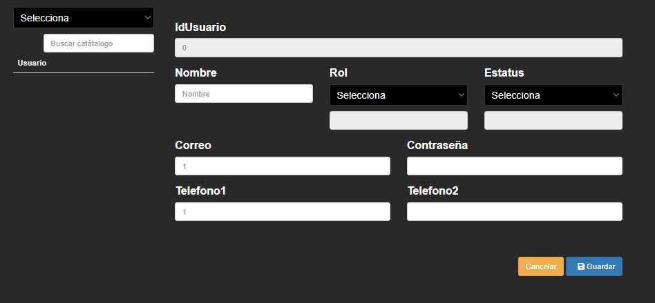
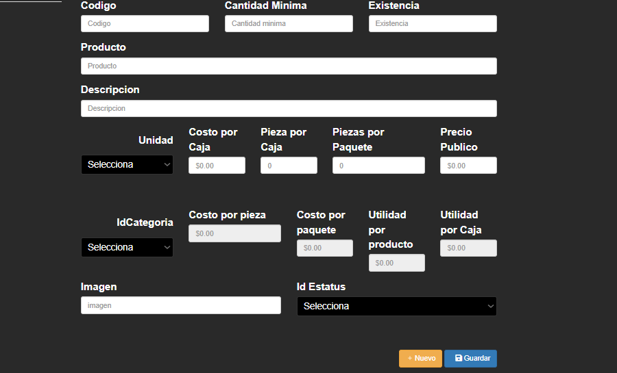
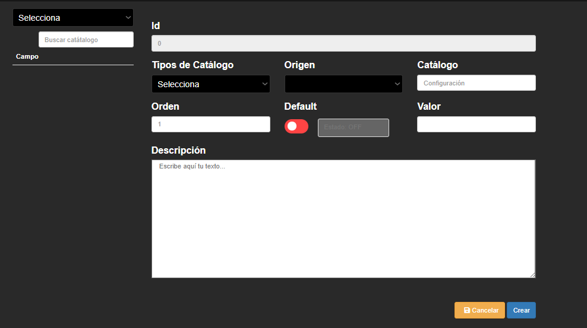
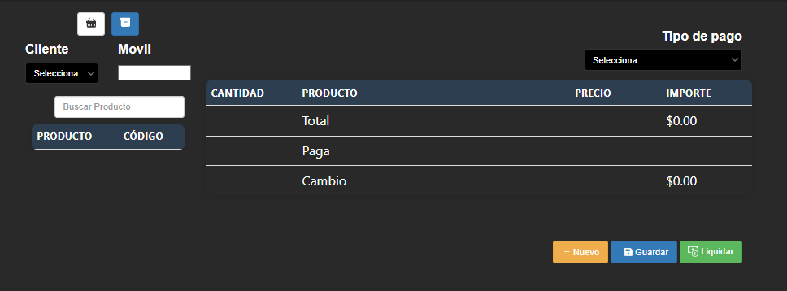

# Sistema Híbrido desarrollado en .Net – Web

Aplicación **web** que forma parte de un **sistema híbrido multiplataforma**, desarrollada como una **plataforma reutilizable** aplicada en distintos dominios de negocio.

Esta aplicación corresponde a la **versión web** del proyecto, compartiendo lógica, modelo de datos y arquitectura con la aplicación móvil del mismo sistema.

---

## 🧠 Descripción General

La aplicación web permite la gestión de procesos empresariales a través de una interfaz accesible desde navegador, enfocada en la administración, consulta y operación de información en tiempo real.

El sistema fue implementado en los siguientes contextos:

* Punto de Venta (POS)
* Historial Clínicos
* Gestión de Pólizas para Aseguradora

---

## 🔗 Proyecto Relacionado

Esta aplicación forma parte del mismo proyecto que:

* 📱 Aplicación Móvil (Android / iOS):  
  [StockpointMovil](https://github.com/jordyH54/StockpointMovil)

---

## 🌐 Funcionalidades Principales

* Gestión de usuarios y roles
* Control de inventarios
* Registro de ventas
* Administración de información por dominio
* Generación de reportes
* Bitácora de actividades

---

## 🛠️ Tecnologías Utilizadas

* HTML
* CSS
* JavaScript
* AJAX
* SQL Server
* C#

---

## 🗄️ Arquitectura

* Comunicación asíncrona mediante AJAX
* Arquitectura modular
* Separación de lógica de negocio y presentación
* Reutilización de componentes

---

## 📌 Características Clave

* Multidominio
* Escalable
* Reutilizable
* Orientado a procesos reales
* Integración con base de datos relacional

  ## ⚙️ Resultados
  En las capturas de pantalla se observa que no se muestran datos en el sistema debido a que actualmente no se cuenta con acceso a la base de datos. Esto se debe a que, durante mi estancia en la empresa, la base de datos era administrada y editada exclusivamente desde los equipos de la empresa. Al finalizar mi periodo de estancia, dicho acceso me fue retirado por lo que el sistema ya no puede establecer conexión con la base de datos.
# Seguridad Login
El funcionamiento del sistema web confirma que el acceso está restringido únicamente a usuarios previamente registrados, validando correctamente sus datos de inicio de sesión y evitando que personas sin autorización puedan ingresar a la plataforma.

  

El mecanismo de restablecimiento de contraseña ofrece a los usuarios una alternativa confiable para recuperar el acceso a la plataforma cuando olvidan sus credenciales, asegurando un proceso controlado que minimiza riesgos de seguridad.

  

# Asignación de roles de usuarios
El sistema administra de forma adecuada los distintos tipos de usuarios, como público, web master, administrador, responsable de piso y vendedor, asignando a cada uno permisos específicos de acuerdo con sus funciones. Esto permite un control claro de las acciones que pueden realizar dentro de la plataforma y fortalece la seguridad del sistema.

  

# Módulo de Ventas e inventario
Esta pantalla permite al usuario registrar y administrar los productos del sistema de manera sencilla. A través de ella se ingresan datos básicos como el código, nombre, descripción, existencia y cantidad mínima del producto. También se pueden definir los costos, precios de venta, utilidades y la forma de presentación del producto (por pieza, caja o paquete). Además, ofrece opciones para asignar una categoría, establecer su estatus y agregar una imagen, lo que ayuda a mantener un mejor control del inventario. Finalmente, cuenta con botones para crear un nuevo registro y guardar la información capturada.

  

Esta pantalla se utiliza para crear y administrar elementos de catálogo dentro del sistema. Permite seleccionar el tipo de catálogo y su origen, asignar un nombre, valor y orden, así como definir si el registro será el valor predeterminado mediante un interruptor. Además, el usuario puede agregar una descripción que facilite la identificación del elemento. La sección de búsqueda ayuda a localizar registros existentes, mientras que las opciones de crear y cancelar permiten guardar los cambios o descartar la información ingresada, facilitando una gestión organizada de las configuraciones del sistema.

  

El sistema permite registrar de forma correcta los diferentes métodos de pago utilizados en cada venta, como efectivo, tarjeta, transferencia u otros disponibles. Esta información se almacena de manera ordenada, lo que apoya el control de ingresos, la administración financiera y la obtención de reportes según el tipo de pago, contribuyendo a una gestión de transacciones confiable y eficiente.

  

---

## 👨‍💻 Autores

**Jordy Manuel Hernandez Rosario**  
**Aaron Cordova Hernandez**

Ingenieros en Sistemas Computacionales
